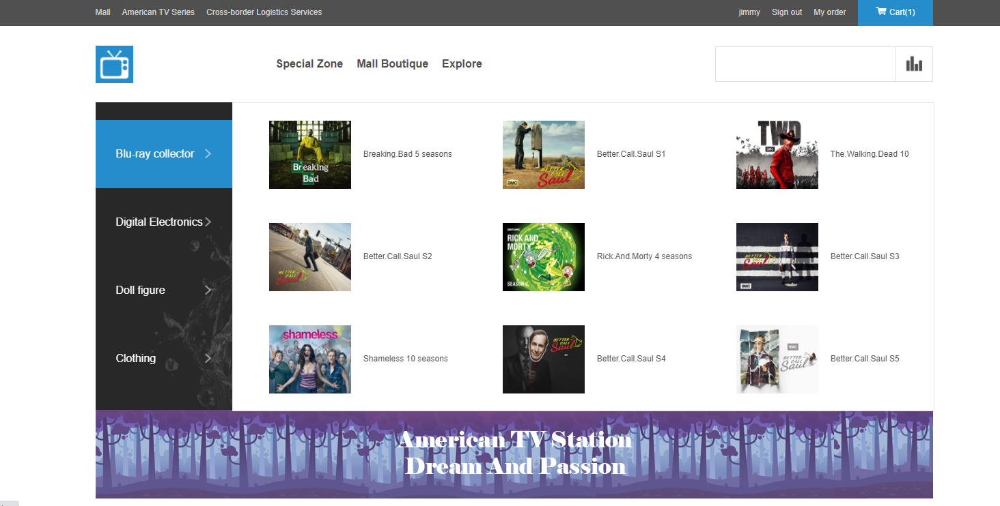
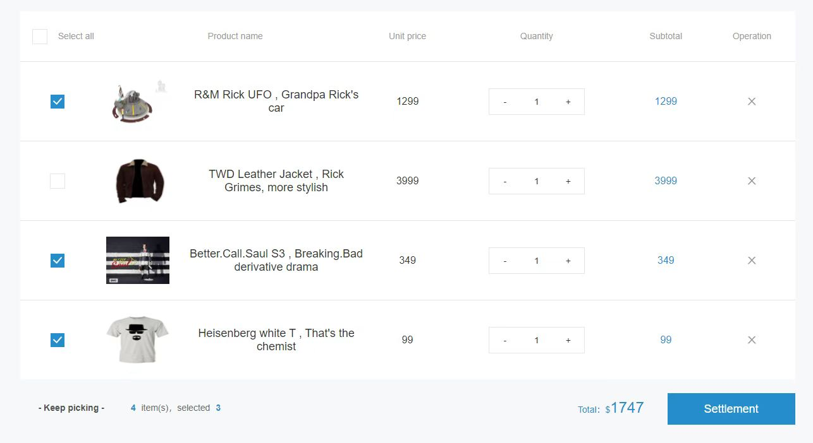
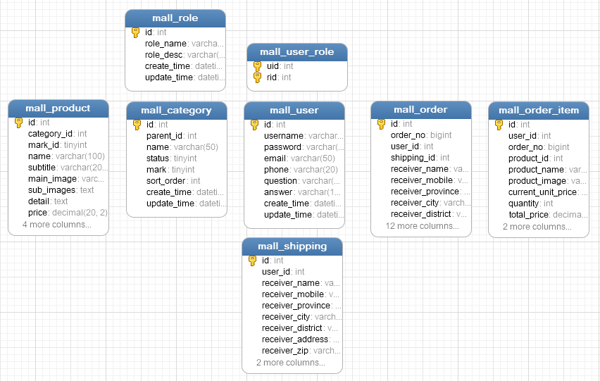

# Spring Boot & Vue 网上商城

# 网上商城

## 简介
#### 一个使用Spring Boot和Vue Cli的全栈网页应用
>这是一个前后端分离的在线商城应用，它主要服务于消费者，包括简单的订单&用户后台管理系统。
>
>前端调用后端API，通过JSON进行数据交互。

#### Demo地址: [https://tvmall-tablu.herokuapp.com/](https://tvmall-tablu.herokuapp.com/)

## 截图

## 特点
- REST API
- 前后端完全JSON交互
- 基于Redis的购物车模块
- 订单处理流程
- 商品分类
- 分页

## 技术栈
**后端**

- Java 8
- Spring Boot 2.1.7
- Mybatis
- MySQL
- Redis
- Spring Security
- Maven

**前端**

- Vue CLI 4.5.4

## 数据库结构

## 敏捷部署及运行
**后端**

1. 安装[MySQL](https://dev.mysql.com/downloads/mysql/5.7.html)
2. 使用MySQL Workbench或者Navicat在本地创建如名为'mall'的数据库
3. 执行SQL语句创建表(`cd backend/src/main/resources/sql`)
4. 准备好[Redis](https://redis.io/)
5. 在`application.yml`配置spring的数据源以及Redis连接
6. 服务端在localhost:8080

**前端**

1. 安装[Node.js and npm](https://www.npmjs.com/get-npm)
2. `cd frontend`
3. 控制台执行 `npm install`
4. 控制台执行 `npm run serve`
5. 客户端在localhost:8081

请注意：这只能在本地运行，发布生产版本到单一页面应用则需要整合代码（前后端）。

